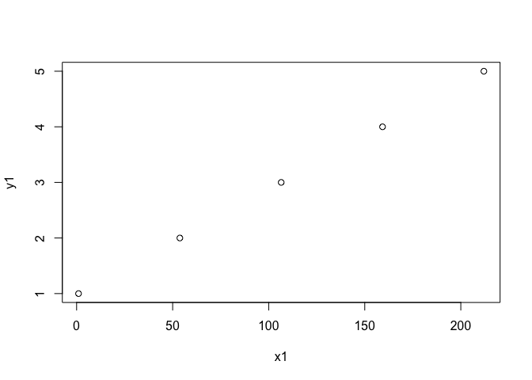
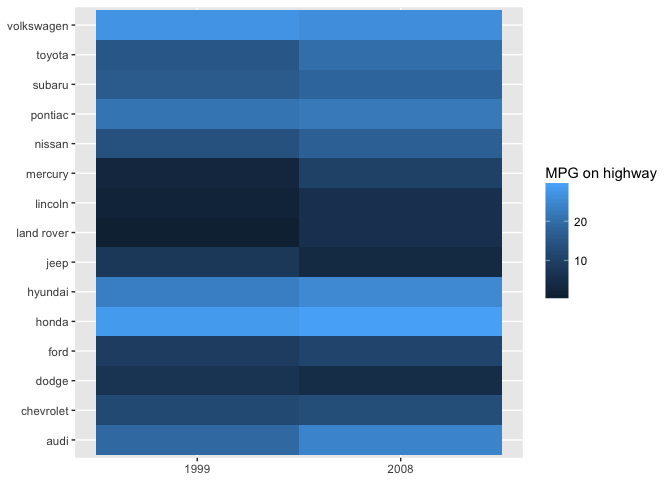
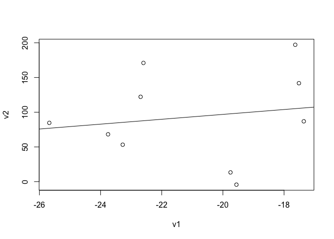
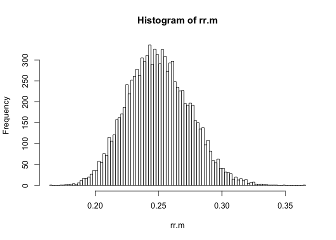
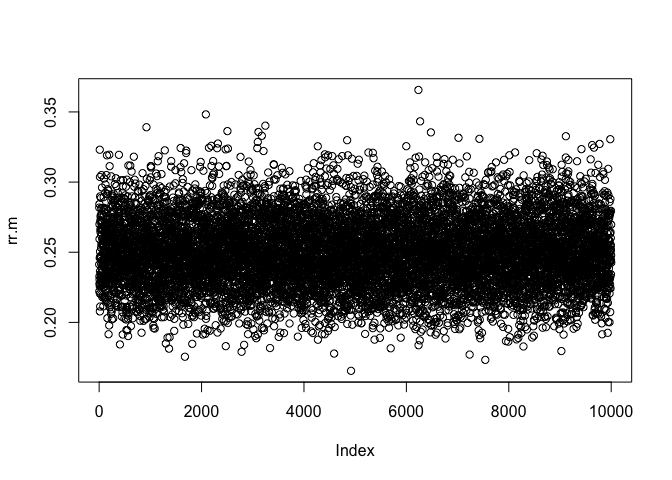

Shitty introduction to R
================
Elias M. Guerra
5/18/2018

This is not a guide on how to code in R. It’s just how I do it. I don’t explain everything that I’m doing. You can figure it out.

Onward.


I had to look at the following pages to figure out how to include the above picture:

1.  <https://dahtah.github.io/imager/imager.html>

2.  <https://stackoverflow.com/questions/26881866/resizing-images-in-rmarkdown>

Comic from: <https://xkcd.com/1838/>

Next.

There are lots of different terms for all the computer stuff that you use in R like vectors, booleans, factors, concatenate, for loops, if else statements, decision trees, etc. I don't know all the names. I don't think it's that big a deal.

### R works like this:

``` r
x <- 1
y <- 2
# This is a comment
z = 3 # Some people say you shouldn't use the equals sign idk 
x
```

    ## [1] 1

``` r
## x <- 100
x + y + z
```

    ## [1] 6

``` r
y^2
```

    ## [1] 4

``` r
y1 <- c(1,2,3,4,5)
x1 <- seq(from = 1, to = 212, length = 5)
x1
```

    ## [1]   1.00  53.75 106.50 159.25 212.00

``` r
plot(x1, y1)
```



``` r
df1 <- data.frame(v1 = rnorm(n = 10, mean = -20, sd = 4),
                  v2 = runif(n = 10, min = -20, max = 212))
?rnorm # Draw n random values from the normal distribution 
?runif # Draw n random value from uniform distribution
df1
```

    ##           v1        v2
    ## 1  -23.75544  68.15180
    ## 2  -17.51353 141.78662
    ## 3  -19.75164  13.28972
    ## 4  -25.67660  84.65390
    ## 5  -23.27595  53.18744
    ## 6  -17.63423 197.10666
    ## 7  -22.69145 122.17323
    ## 8  -22.59863 170.96023
    ## 9  -19.55743  -4.34810
    ## 10 -17.35485  86.88373

``` r
str(df1) # This is better than printing a huge data frame
```

    ## 'data.frame':    10 obs. of  2 variables:
    ##  $ v1: num  -23.8 -17.5 -19.8 -25.7 -23.3 ...
    ##  $ v2: num  68.2 141.8 13.3 84.7 53.2 ...

``` r
df1$v1
```

    ##  [1] -23.75544 -17.51353 -19.75164 -25.67660 -23.27595 -17.63423 -22.69145
    ##  [8] -22.59863 -19.55743 -17.35485

``` r
df1$v1[1]
```

    ## [1] -23.75544

``` r
df1[1,1]
```

    ## [1] -23.75544

``` r
df1[1:5,]
```

    ##          v1        v2
    ## 1 -23.75544  68.15180
    ## 2 -17.51353 141.78662
    ## 3 -19.75164  13.28972
    ## 4 -25.67660  84.65390
    ## 5 -23.27595  53.18744

``` r
df1$v2 > 100 
```

    ##  [1] FALSE  TRUE FALSE FALSE FALSE  TRUE  TRUE  TRUE FALSE FALSE

``` r
true.false <- df1$v2 > 100
df1[true.false,]
```

    ##          v1       v2
    ## 2 -17.51353 141.7866
    ## 6 -17.63423 197.1067
    ## 7 -22.69145 122.1732
    ## 8 -22.59863 170.9602

``` r
df1$v1[true.false]
```

    ## [1] -17.51353 -17.63423 -22.69145 -22.59863

This is all just one big logic problem.

### This is a big one:

This is a for loop.

``` r
for (i in 1:5) {
  print(i)
}
```

    ## [1] 1
    ## [1] 2
    ## [1] 3
    ## [1] 4
    ## [1] 5

``` r
n <- 5 # This line is useful
xx <- seq(1,100,length = n)
for (i in 1:n) {
  aa <- xx[i]
  print(aa) ## I could also have written print(xx[i])
}
```

    ## [1] 1
    ## [1] 25.75
    ## [1] 50.5
    ## [1] 75.25
    ## [1] 100

``` r
## Take a look at xx if this does not make sense
```

You can do a lot with for loops. Below is just an example.

I'm using this dataset from the ggplot2 package about 38 popular car models in 1999 and 2008. I want to know the average miles per gallon (on the highway) for each manufacturer in 1999 and 2008.

``` r
## install.packages("ggplot2")
## You'll need to uncomment the above line if you want to run this yourself
library(ggplot2)
library(knitr)
unique(mpg$hwy)
```

    ##  [1] 29 31 30 26 27 25 28 24 23 20 15 17 19 14 22 21 18 12 16 33 32 34 36
    ## [24] 35 37 44 41

``` r
unique(mpg$year)
```

    ## [1] 1999 2008

``` r
unique(mpg$manufacturer)
```

    ##  [1] "audi"       "chevrolet"  "dodge"      "ford"       "honda"     
    ##  [6] "hyundai"    "jeep"       "land rover" "lincoln"    "mercury"   
    ## [11] "nissan"     "pontiac"    "subaru"     "toyota"     "volkswagen"

``` r
mpg.hwy <- matrix(ncol = 3, nrow = 0)
for (y in unique(mpg$year)) {
  for (m in unique(mpg$manufacturer)) {
    mm <- mpg[mpg$year == y & mpg$manufacturer == m, ]
    ifelse(nrow(mm) == 0, h <- NA, h <- mean(mm$hwy))
    new.row <- c(yr = y, man = m, hwy = h)
    mpg.hwy <- rbind(mpg.hwy, new.row)
  }
}
data.frame(mpg.hwy)
```

    ##      yr        man              hwy
    ## 1  1999       audi 26.1111111111111
    ## 2  1999  chevrolet 21.5714285714286
    ## 3  1999      dodge          18.4375
    ## 4  1999       ford             18.6
    ## 5  1999      honda             31.6
    ## 6  1999    hyundai 26.6666666666667
    ## 7  1999       jeep             18.5
    ## 8  1999 land rover               15
    ## 9  1999    lincoln             16.5
    ## 10 1999    mercury               17
    ## 11 1999     nissan             23.5
    ## 12 1999    pontiac 26.3333333333333
    ## 13 1999     subaru             25.5
    ## 14 1999     toyota            24.05
    ## 15 1999 volkswagen          29.6875
    ## 16 2008       audi 26.7777777777778
    ## 17 2008  chevrolet 22.0833333333333
    ## 18 2008      dodge 17.5714285714286
    ## 19 2008       ford             20.5
    ## 20 2008      honda            33.75
    ## 21 2008    hyundai               27
    ## 22 2008       jeep 17.3333333333333
    ## 23 2008 land rover               18
    ## 24 2008    lincoln               18
    ## 25 2008    mercury               19
    ## 26 2008     nissan 25.5714285714286
    ## 27 2008    pontiac             26.5
    ## 28 2008     subaru           25.625
    ## 29 2008     toyota 26.1428571428571
    ## 30 2008 volkswagen 28.5454545454545

``` r
qplot(data = data.frame(mpg.hwy), 
      geom = "tile", 
      x = yr, y = man, fill= as.numeric(hwy),
      xlab = NULL, ylab = NULL) + 
  labs(fill = "MPG on highway") 
```



### Here are some basic statistics tools:

``` r
lm1 <- lm(data = df1, v2 ~ v1)
# lm(df1$v1 ~ df1$v2)   ## This would also work
?lm # Fit a linear model to your data 
plot(data = df1, v2 ~ v1)
abline(lm1)
```



``` r
rr.m <- NULL # See what happens when you leave this step out
for (i in 1:10000) {
  rr <- rexp(100, rate = 4)
  rr.m[i] <- mean(rr)
}
hist(rr.m, breaks = 100)
```



``` r
plot(rr.m)
```



Those are most of the basics.

Other things:

-   Functions: I've really been trying to write more of the long code I do as functions. This means I don't have to copy and paste it elsewhere.
